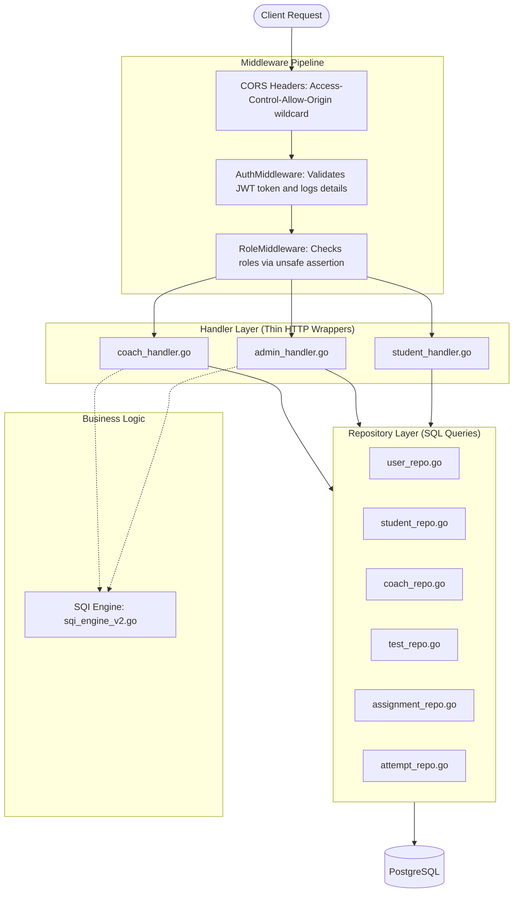
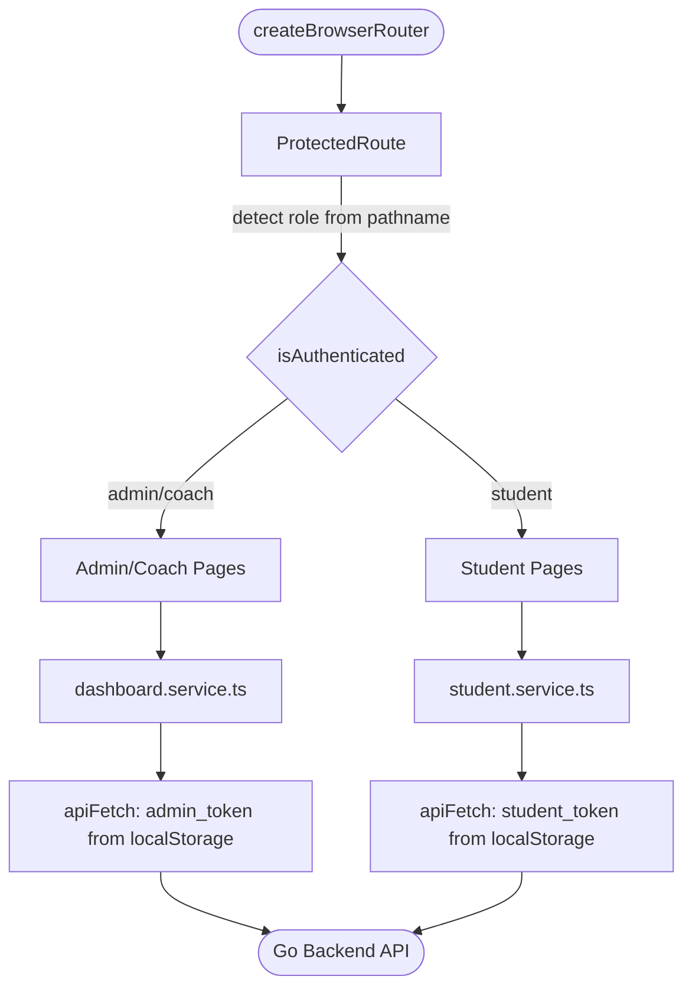

# AI-Student Diagnostic System: Backend Code Review Report

**Date:** 2026-06-26 (Updated after N-Tier refactoring)
**Scope:** Full Go Backend (`backend/`)
**Overall Status:** Action Required (5 backend issues remaining, architecture refactored)

---

## Backend Architecture Map



---

## Security Issues (High Priority)

<a id="issue-1"></a>

> [!CAUTION]
> **1. Multi-tenancy Bypass in StudentLogin**
> * **File & Lines:** student_handler.go
> * **Risk Level:** **CRITICAL**
> * **Description:** The `StudentLogin` function queries students using only `student_code` without filtering or verifying `tenant_id`. Any student code from any organization can log in. Moreover, since `student_code` is defined as database-wide `UNIQUE` in migrations, Tenant A's student codes block Tenant B from registering matching codes.
> * **Remediation:** Introduce namespaced student codes or require `tenant_id`/organization prefix during registration and login. Ensure the database queries strictly constrain students within the requested tenant.
>
> [← Back to list](#-priority-fix-checklist)

<a id="issue-2"></a>

> [!NOTE]
> **2. ~~Unsafe Google OAuth Type Assertion~~ [RESOLVED]**
> * **File & Lines:** auth_service.go
> * **Risk Level:** ~~HIGH~~
> * **Description:** ~~The type assertion `payload.Claims["email"].(string)` will immediately panic if the `email` claim is missing, nil, or not a string.~~ Fixed. The logic was moved to `auth_service.go:107-108` using comma-ok pattern: `email, ok := payload.Claims["email"].(string)` with graceful error return.

> [← Back to list](#-priority-fix-checklist)

<a id="issue-3"></a>

> [!NOTE]
> **3. ~~Google OAuth Token Error Ignored~~ [RESOLVED]**
> * **File & Lines:** auth.go
> * **Risk Level:** ~~HIGH~~
> * **Description:** ~~`token, _ := utils.GenerateToken(userID, role, 0)` silently ignores error generation failures.~~ Fixed. `auth.go:160-163` now uses `token, err := utils.GenerateToken(...)` with `if err != nil` check returning `500 Internal Server Error`.

> [← Back to list](#-priority-fix-checklist)

<a id="issue-4"></a>

> [!WARNING]
> **4. Permissive CORS Wildcard Policy**
> * **File & Lines:** routes.go
> * **Risk Level:** **MEDIUM**
> * **Description:** The CORS header `Access-Control-Allow-Origin: *` is hardcoded. This allows any arbitrary domain to access backend endpoints, which is a major compliance and security concern for production.
> * **Remediation:** Retrieve allowed origins from environment/config files and dynamically map them in the middleware.
>
> [← Back to list](#-priority-fix-checklist)

<a id="issue-5"></a>

> [!NOTE]
> **5. ~~RoleMiddleware Unsafe Type Assertion~~ [RESOLVED]**
> * **File & Lines:** roleMiddleware.go
> * **Risk Level:** ~~MEDIUM~~
> * **Description:** ~~`roleVal.(string)` will panic if `roleVal` is not a string.~~ Fixed. The type assertion now uses the comma-ok pattern.
>
> [← Back to list](#-priority-fix-checklist)

<a id="issue-6"></a>

> [!NOTE]
> **6. ~~JWT Token Debug Logging in Production~~ [RESOLVED]**
> * **Files & Lines:** auth.go and jwt.go
> * **Risk Level:** ~~MEDIUM~~
> * **Description:** ~~Sensitive authentication tokens are printed to `stdout` on every single request.~~ Fixed. The `TokenPreview` logic was completely removed.
>
> [← Back to list](#-priority-fix-checklist)

<a id="issue-7"></a>

> [!WARNING]
> **7. No Rate Limiting on Credentials/Login Endpoints**
> * **File:** routes.go
> * **Risk Level:** **MEDIUM**
> * **Description:** There is no rate limiting middleware anywhere. All login and API endpoints are vulnerable to automated brute-force attempts and DoS.
> * **Remediation:** Implement rate limiters (e.g. `golang.org/x/time/rate`) on `/auth/login` and `/student/login` endpoints.
>
> [← Back to list](#-priority-fix-checklist)

<a id="issue-8"></a>

> [!NOTE]
> **8. Super Admin Password Visible in Process Tree**
> * **File & Lines:** createsuperadmin/main.go
> * **Risk Level:** **LOW**
> * **Description:** Super admin creation reads passwords via flags. Commands containing these flags are visible to other users on the system via process list utilities.
> * **Remediation:** Allow reading from standard input interactively or environment variables exclusively.
>
> [← Back to list](#-priority-fix-checklist)

<a id="issue-9"></a>

> [!CAUTION]
> **9. Client-Side Trust of Exam Timing & Attempt Lifecycle**
> * **File & Lines:** student_handler.go
> * **Risk Level:** **CRITICAL**
> * **Description:** The backend has no "start attempt" API endpoint; attempt records are created only at the moment of answer submission. Because of this, both `started_at` and `submitted_at` store identical timestamps, meaning elapsed time cannot be verified server-side.
> * **Remediation:** Introduce a `POST /student/attempts/start` endpoint to log the exam start time on the server.
>
> [← Back to list](#-priority-fix-checklist)

<a id="issue-10"></a>

> [!WARNING]
> **10. ~~Global UNIQUE Constraint on student_code Bypasses Multi-Tenancy~~ [RESOLVED]**
> * **Files & Lines:** 000001_init.up.sql
> * **Risk Level:** ~~MEDIUM~~
> * **Description:** ~~`students.student_code` has a database-wide `UNIQUE` constraint.~~ Fixed. Migrated to tenant-scoped partial unique index: `CREATE UNIQUE INDEX idx_active_student_code ON students (tenant_id, student_code) WHERE deleted_at IS NULL;`
>
> [← Back to list](#-priority-fix-checklist)

<a id="issue-11"></a>

> [!WARNING]
> **11. ~~Restrictive Cross-Coach Assignment Validation~~ [NOT A BUG]**
> * **File & Lines:** admin_handler.go
> * **Risk Level:** ~~MEDIUM~~
> * **Description:** ~~In `CreateAssignment`, the handler validates that both the student and the test must belong to the same `coach_id`.~~ This is intentional business logic. A physics coach can only assign physics tests, a math coach can only assign math tests. No cross-subject assignment allowed.
>
> [← Back to list](#-priority-fix-checklist)

<a id="issue-12"></a>

> [!WARNING]
> **12. Super Admin Role Access Lockout**
> * **File & Lines:** routes.go
> * **Risk Level:** **MEDIUM**
> * **Description:** The `super_admin` role is created with `tenant_id = NULL`. However, the `/admin` routes group is protected by `RoleMiddleware("admin")` which strictly requires the `"admin"` role. Super admin users are completely locked out.
> * **Remediation:** Update `RoleMiddleware` on admin/coach endpoints to also permit `"super_admin"`.
>
> [← Back to list](#-priority-fix-checklist)

---

## Code Quality Issues (Medium Priority)

<a id="issue-13"></a>

> [!IMPORTANT]
> **13. ~~Monolithic admin_handler.go File Size~~ [RESOLVED]**
> * **File:** admin_handler.go
> * **Description:** ~~The file contains **2276 lines** and manages everything.~~ Fixed. Admin handler reduced to ~1186 lines with all SQL moved to repository layer. Business logic extracted to services.
>
> [← Back to list](#-priority-fix-checklist)

<a id="issue-14"></a>

> [!IMPORTANT]
> **14. ~~Severe Code Duplication between Admin and Coach Handlers~~ [RESOLVED]**
> * **Files:** admin_handler.go & coach_handler.go
> * **Description:** ~~Complex endpoints duplicated verbatim.~~ Fixed. Both handlers now call the same repository methods with optional `coachID` parameter for scoping. Zero duplicated SQL remains.
>
> [← Back to list](#-priority-fix-checklist)

<a id="issue-15"></a>

> [!IMPORTANT]
> **15. ~~Duplicated parsePagination Helper~~ [RESOLVED]**
> * **Files:** admin_handler.go & coach_handler.go
> * **Description:** ~~Identical pagination query parsers copy-pasted.~~ Fixed. Extracted to `utils/pagination.go:ParsePagination()`.
>
> [← Back to list](#-priority-fix-checklist)

<a id="issue-16"></a>

> [!IMPORTANT]
> **16. ~~Unchecked Database Scanning Error in GetAssignmentResults~~ [RESOLVED]**
> * **File & Lines:** admin_handler.go
> * **Description:** ~~Database errors from `.Scan()` completely ignored.~~ Fixed. Repository methods now handle scanning and return errors properly to handlers.
>
> [← Back to list](#-priority-fix-checklist)

<a id="issue-17"></a>

> [!IMPORTANT]
> **17. ~~Config Load Disconnection~~ [RESOLVED]**
> * **Files:** config.go vs jwt.go
> * **Description:** ~~Environment variables `JWTSecret` and `JWTExpiry` are loaded in `config.Config`, but never used. `jwt.go` reads configuration parameters directly from environment variables on demand.~~ Fixed. JWT utilities now receive config via `InitJWTConfig(cfg.JWTSecret, cfg.JWTExpiry)` in `main.go`.
>
> [← Back to list](#-priority-fix-checklist)

<a id="issue-18"></a>

> [!NOTE]
> **18. ~~Cross-Tenant Coach Reassignment Vulnerability~~ [RESOLVED]**
> * **File & Lines:** admin_handler.go
> * **Description:** ~~The `UpdateTest` method updates tests using a client-provided `coach_id` without confirming that the coach ID belongs to the current tenant.~~ Fixed. Before executing the UPDATE, the handler now validates coach tenant affiliation.
>
> [← Back to list](#-priority-fix-checklist)

---

## Architectural Issues

<a id="issue-19"></a>

> [!TIP]
> **19. ~~Absence of Service & Repository Layers~~ [RESOLVED]**
> * **Description:** ~~Handlers contain hardcoded SQL scripts and execute business logic directly.~~ Fixed. N-Tier architecture implemented:
>   - **Repository Layer** (6 files): `user_repo.go`, `student_repo.go`, `coach_repo.go`, `test_repo.go`, `assignment_repo.go`, `attempt_repo.go`
>   - **Service Layer** (6 files): `auth_service.go`, `student_service.go`, `coach_service.go`, `test_service.go`, `assignment_service.go`, `attempt_service.go`
>   - **Handler Layer**: All three handlers refactored to thin HTTP wrappers
>
> [← Back to list](#-priority-fix-checklist)

<a id="issue-20"></a>

> [!TIP]
> **20. Zero Unit Test Coverage**
> * There are no automated tests anywhere in the codebase.
> * The SQI Diagnostic Engine contains complex logic (`sqi_engine_v2.go` - **974 lines**) with calculations for Mastery, Speed, Risk, and Coverage. These need testing immediately.
>
> [Back to list](#-priority-fix-checklist)

<a id="issue-21"></a>

> [!TIP]
> **21. ~~Global Mutable Database Singleton~~ [RESOLVED]**
> * **Description:** ~~The package-level `repository.DB` variable makes tests difficult to parallelize.~~ Fixed. Global singleton removed. DB now injected via constructors:
>   ```go
>   repo.NewUserRepo(db)
>   repo.NewStudentRepo(db)
>   // etc.
>   ```
>
> [← Back to list](#-priority-fix-checklist)

<a id="issue-22"></a>

> [!NOTE]
> **22. ~~Missing Health Check Endpoint~~ [RESOLVED]**
> * **Description:** ~~No `/health` or `/ready` endpoints configured.~~ Fixed. Added `GET /health` endpoint that pings the database.
>
> [← Back to list](#-priority-fix-checklist)

---

## Priority Fix Checklist

| # | Issue | Severity | Effort | Status |
|---|---|---|---|---|
| 1 | [Multi-tenancy Bypass in StudentLogin](#issue-1) | High | Small | **TODO** |
| 2 | ~~Unsafe Google OAuth Type Assertion~~ | High | Small | **DONE** |
| 3 | ~~Google OAuth Token Error Ignored~~ | High | Small | **DONE** |
| 4 | [Permissive CORS Wildcard Policy](#issue-4) | Medium | Small | **TODO** |
| 5 | ~~RoleMiddleware Unsafe Type Assertion~~ | Medium | Small | **DONE** |
| 6 | ~~JWT Token Debug Logging in Production~~ | None | Small | **DONE** |
| 7 | [No Rate Limiting on Login Endpoints](#issue-7) | Medium | Medium | **TODO** |
| 8 | [Super Admin Password Visible in Process Tree](#issue-8) | Low | Small | **TODO** |
| 9 | [Client-Side Trust of Exam Timing](#issue-9) | High | Medium | **TODO** |
| 10 | ~~Global UNIQUE on student_code Bypasses Multi-Tenancy~~ | Medium | Small | **DONE** |
| 11 | ~~Restrictive Cross-Coach Assignment~~ | Medium | Small | **N/A** |
| 12 | [Super Admin Role Access Lockout](#issue-12) | Medium | Small | **TODO** |
| 13 | ~~Monolithic admin_handler.go~~ | Low | Large | **DONE** |
| 14 | ~~Severe Code Duplication~~ | Medium | Large | **DONE** |
| 15 | ~~Duplicated parsePagination~~ | Medium | Small | **DONE** |
| 16 | ~~Unchecked DB Scanning Error~~ | Medium | Small | **DONE** |
| 17 | ~~Config Load Disconnection~~ | Low | Small | **DONE** |
| 18 | ~~Cross-Tenant Coach Reassignment~~ | Medium | Small | **DONE** |
| 19 | ~~Absence of Service & Repository Layers~~ | Low | Large | **DONE** |
| 20 | [Zero Unit Test Coverage](#issue-20) | Low | Large | **TODO** |
| 21 | ~~Global Mutable Database Singleton~~ | Low | Medium | **DONE** |
| 22 | ~~Missing Health Check Endpoint~~ | Low | Small | **DONE** |

### Summary: 17 DONE, 5 TODO

---

# Frontend Code Review Report

**Date:** 2026-06-26 (Updated 2026-06-30)
**Scope:** Full React/TypeScript Frontend (`frontend/src/`)
**Overall Status:** Action Required (Security holes in token storage, role detection, and unshipped UI pages using mock data)

---

## Frontend Architecture Map



---

## Security Issues

> [!CAUTION]
> **FE-1. JWT Tokens Stored in `localStorage` — XSS-Accessible**
> * **Files:** api.ts, StudentLoginPage.tsx, ProtectedRoute.tsx
> * **Risk Level:** **HIGH**
> * **Description:** Both `admin_token` and `student_token` are stored in `localStorage`, which is fully accessible to any JavaScript running on the page. A single XSS vector can exfiltrate all tokens silently.
> * **Remediation:** Switch to `HttpOnly`, `Secure`, `SameSite=Strict` cookies managed by the backend.

> [!CAUTION]
> **FE-2. `useRole` Hook — Unreliable & Cross-Role Leakage**
> * **File:** useRole.ts
> * **Risk Level:** **HIGH**
> * **Description:** `useRole` derives the active role purely from the URL path and `localStorage.admin_role`. This means a coach visiting a non-prefixed URL can be treated as an admin.
> * **Remediation:** Derive role exclusively from the validated JWT payload, not from URL prefix string matching.

> [!WARNING]
> **FE-3. ~~`student_role` Key Written but Never Read~~ [RESOLVED]**
> * **File:** StudentLoginPage.tsx
> * **Risk Level:** ~~MEDIUM~~
> * **Description:** ~~`localStorage.setItem("student_role", "student")` is set on login but never read by any consumer.~~ Fixed. Removed the unused write from `StudentLoginPage.tsx`.
>
> [← Back to list](#-priority-fix-checklist)

> [!WARNING]
> **FE-4. ~~`exam_started` Flag Trusted Blindly — Auth Bypass~~ [RESOLVED]**
> * **File:** StudentLoginPage.tsx, StudentInstructionsPage.tsx, StudentDashboardPage.tsx
> * **Risk Level:** ~~MEDIUM~~
> * **Description:** ~~On login, if `localStorage.getItem("exam_started") === "true"`, the student is immediately routed to `/quiz` — bypassing the instructions page. This flag can be manually injected via DevTools.~~ Fixed. Removed the injectable bypass from `StudentLoginPage.tsx`. Added "exam in progress" resume banner on `StudentDashboardPage.tsx`. Preserved timer on resume in `StudentInstructionsPage.tsx` by not overwriting `exam_started_at` if already set.
>
> [← Back to list](#-priority-fix-checklist)

> [!NOTE]
> **FE-15. ~~Student Token Field Name Mismatch~~ [RESOLVED]**
> * **Files:** auth.service.ts, StudentLoginPage.tsx
> * **Risk Level:** **HIGH**
> * **Description:** ~~Backend returns `{ "token": "..." }` but frontend expected `{ "access_token": "..." }`. This caused `student_token` to be stored as the string `"undefined"`, silently breaking student login.~~ Fixed. Updated `StudentLoginResponse` interface to use `token` field and updated `StudentLoginPage.tsx` to read `result.token`.
>
> [← Back to list](#-priority-fix-checklist)

> [!IMPORTANT]
> **FE-5. Multiple Pages Powered by Static Mock Data**
> * **Files:** BillingPage.tsx, SettingsPage.tsx, NotificationsPage.tsx
> * **Description:** These pages render data from `mockData.ts` — static hard-coded objects. These pages appear functional but persist no real data.
> * **Remediation:** Connect each page to real backend endpoints.

> [!IMPORTANT]
> **FE-6. `SettingsPage` — Save Handlers are No-Ops**
> * **File:** SettingsPage.tsx
> * **Description:** `handleSaveProfile` and `handleSaveNotifications` simulate a delay then fire a success toast — but nothing is persisted.
> * **Remediation:** Wire all save actions to real API endpoints.

> [!IMPORTANT]
> **FE-7. `getPrefix()` Reads `localStorage` at Call Time — Stale Role Risk**
> * **File:** dashboard.service.ts
> * **Description:** `getPrefix()` reads `localStorage.getItem("admin_role")` at the moment of each service call. If the user's role changes mid-session, the prefix can silently switch.
> * **Remediation:** Bind role to a React context or store initialized once on login.

> [!IMPORTANT]
> **FE-8. ~~`getDashboardCounts` Makes 3 Parallel Requests with No Error Isolation~~ [RESOLVED]**
> * **File:** dashboard.service.ts
> * **Description:** ~~`Promise.all` is used to batch 3 API calls. If any one fails, all 3 counts are lost.~~ Fixed. Replaced with `Promise.allSettled`. Failed requests now default to `0` instead of crashing all counts.
>
> [← Back to list](#-priority-fix-checklist)

---

## Code Quality Issues

> [!NOTE]
> **FE-9. `pending_submission` Queue — Written but Never Drained**
> * **File:** StudentQuizPage.tsx
> * **Description:** On submission failure, answers are queued to `localStorage`. There is no retry mechanism.
> * **Remediation:** Implement a retry-on-reconnect handler or show a manual retry button.

> [!NOTE]
> **FE-10. `useExamTimer` Has Suppressed ESLint Dependency Warnings**
> * **File:** useExamTimer.ts
> * **Description:** Two `useEffect` blocks suppress the exhaustive-deps lint rule.
> * **Remediation:** Document the intent or restructure with `useRef`.

> [!NOTE]
> **FE-11. ~~`StudentInstructionsPage` Calls `localStorage.removeItem` at Render Time~~ [RESOLVED]**
> * **File:** StudentInstructionsPage.tsx
> * **Risk Level:** ~~LOW~~
> * **Description:** ~~Side effect called directly in function body, outside `useEffect`.~~ Fixed. Moved into a `useEffect` with empty dependency array.
>
> [← Back to list](#-priority-fix-checklist)

> [!NOTE]
> **FE-12. ~~Route for `about` Missing Leading Slash~~ [RESOLVED]**
> * **File:** routes.ts
> * **Risk Level:** ~~NONE~~
> * **Description:** ~~Route declared as `{ path: "about" }` without leading `/`.~~ Fixed. Changed to `{ path: "/about" }`.
>
> [← Back to list](#-priority-fix-checklist)

> [!NOTE]
> **FE-13. ~~`TestDetailPage` Calls `apiFetch` Directly, Bypassing the Service Layer~~ [RESOLVED]**
> * **File:** TestDetailPage.tsx
> * **Risk Level:** ~~LOW~~
> * **Description:** ~~Imports and calls `apiFetch` directly instead of routing through `dashboard.service.ts`.~~ Fixed. Added `getTest()` and `getTestQuestions()` to `dashboard.service.ts`. Updated `TestDetailPage.tsx` to use service functions. Added `TestDetail` and `TestQuestion` types to `services/types.ts`. Removed unused `apiFetch` import and `apiPrefix` variable.
>
> [← Back to list](#-priority-fix-checklist)

> [!NOTE]
> **FE-14. `time_spent` Accumulation Timer Drift**
> * **File:** useAnswerTracker.ts
> * **Description:** `setInterval` at 1-second ticks may drift over long exams.
> * **Remediation:** Record `startedAt` timestamp and compute at navigation time.

---

## Frontend Priority Fix Checklist

| # | Issue | Severity | Effort | Status |
|---|---|---|---|---|
| FE-1 | JWT tokens in `localStorage` (XSS-accessible) | High | Large | **TODO** |
| FE-2 | `useRole` unreliable role detection | High | Small | **TODO** |
| FE-3 | ~~`student_role` key written but never read~~ | Medium | Small | **DONE** |
| FE-4 | ~~`exam_started` localStorage flag injectable~~ | Medium | Medium | **DONE** |
| FE-5 | Multiple pages render static mock data | Medium | Large | **TODO** |
| FE-6 | `SettingsPage` save handlers are no-ops | Medium | Medium | **TODO** |
| FE-7 | `getPrefix()` reads stale role | Medium | Medium | **TODO** |
| FE-8 | ~~`getDashboardCounts` Promise.all failure~~ | Low | Small | **DONE** |
| FE-9 | `pending_submission` queue never drained | Low | Medium | **TODO** |
| FE-10 | Suppressed ESLint dep warnings | Low | Small | **TODO** |
| FE-11 | ~~Side effect outside useEffect~~ | Low | Small | **DONE** |
| FE-12 | ~~`about` route missing leading `/`~~ | None | Small | **DONE** |
| FE-13 | ~~`TestDetailPage` bypasses service layer~~ | Low | Small | **DONE** |
| FE-14 | `time_spent` timer drift | Low | Medium | **TODO** |
